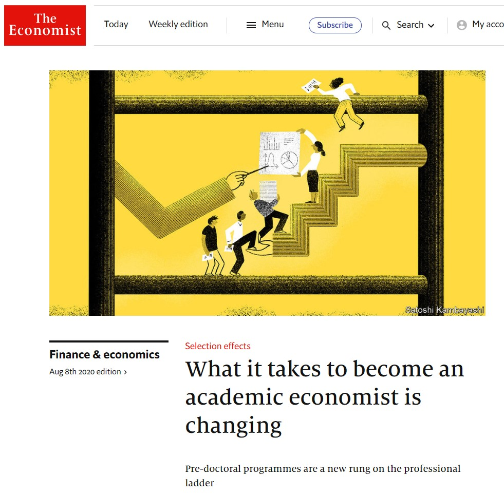

```{r setup, include=FALSE}
knitr::opts_chunk$set(echo = FALSE)
```

## ¿Qué es un Pre-Doctoral Fellowship?
```{r, out.width='50%', fig.align='center', fig.cap='...'}

```

## ¿hay fechas específicas? O ¿es conforme se publiquen?


## ¿a qué partes de la aplicación le dan mas peso?

## ¿Cual es el nivel que esperan que tengas de conocimientos de programación? 

## Postulación | ¿me podrías decir mas o menos de que tratan?

## ¿consideras que es mejor opción un predoc que hacer una maestría?

- Bullet 1
- Bullet 2
- Bullet 3

