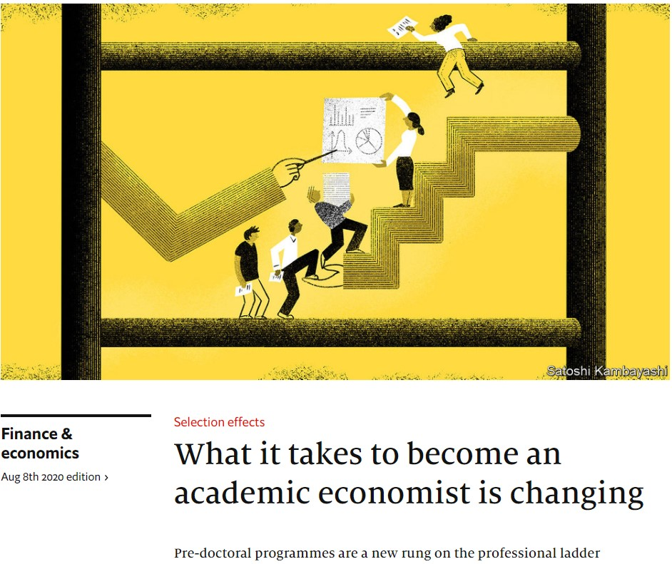

```{r setup, include=FALSE}
knitr::opts_chunk$set(echo = FALSE)
```

## ¿Qué es un Pre-Doctoral Fellowship?
```{r, out.width='35%', fig.align='center', fig.cap='...'}

```
- Un programa de aprox. 2 años donde trabajas con uno o varios PIs en distintos proyectos

    + Los proyectos pueden estar en distintas etapas de ejecución

## ¿Qué lo diferencia de un RAship estándar? (1/2)

Los RAships han existido desde hace mucho

- Para internacionales significa :

    + Trabajar con un PI local
    + Trabajar con un PI extranjero pero desde Perú
    + No significaba necesariamente una señal para hacer el PhD (exccepto con PI extranjero)
    + Era un complemento a la maestria para postular al extranjero

## ¿Qué lo diferencia de un RAship estándar? (2/2)

- El Predoc es un RAship institucionalizado con una señalización más clara para el PhD

    + Tus PIs saben que quieres hacer el PhD (tu placement es útil para ellos)
    + Desarrollas herramientas exclusivas para el Grad School
      + Llevas cursos de mate 
    
    + Charlas de Phd Students
    + Entrevistas/conexiones con otros investigadores (y hr)
    

## ¿Hay fechas específicas? O ¿es conforme se publiquen?

- Los RAships estándar tienen puestos abiertos todo el año (hay que estar atentas)

- Los Predocs como programas tienen cortes importantes:
    
    + Noviembre/diciembre -> para empezar en marzo
    + Mayo/Junio -> para empezar en agosto
    + Ejemplo: 
  [The SIEPR/Economics Predoctoral Research Fellowship program](https://siepr.stanford.edu/programs/predoctoral-research-fellowship-opportunities)
    ```{r, out.width='25%', fig.align='center', fig.cap='...'}
knitr::include_graphics('figures/stanford predoc.jpg')
```
## ¿Qué requisitos debo cumplir para postular?

- No hay una regla fija, si estás interesada postula de todas formas
- Algunas condiciones a considerar (no estrictas!) son:

    + Haber tenido un buen promedio en el undergrade
    + Sobre todo en cursos relevantes (quanti)
    + Tener experiencia en research
    + Depende de tu situación al momento de postular: recien egresada, o ya con tiempo de trabajo post-egreso
    
  + Dominio de softwares como Stata, Latex (si eres macro: R, Matlab, latex) 

## Postulación 


## ¿Cuáles son las etapas de postulación? (1/3)

1. Enviar correctamente todos los documentos solicitados
  
    + CV: Tener un CV alineado a los requisitos en las convocatorias
    + Transcripts: Notas del pregrado en formato pdf (si estan traducidos mejor)
    + Cover Letter: Tener un template y adaptarlo para cada convocatoria
    + Writting Sample: Algun documento de investigación propio o coautoreado, mejor si está en inglés
    + Letter of Recomendation: No todos piden pero es mejor tener mapeado quién podría brindarnos estas cartas en un plazo breve (2 personas)
    + [Opcional] Toefl o GRE: He visto que algunos programas piden toefl pero no es común
- Que te respondan que los documentos han sido recibidos y que les interesa tu perfil (no siempre responden)

    
## ¿Cuáles son las etapas de postulación? (2/3)

2. Realizar data-management tasks (software común: Stata)

    + Cleaning data
    + Coding: hacer tablas y gráficos automatizadas 
    + Análisis: Armar un mini reporte con los resultados que encontraste (writing)
    + LaTex o Markdown 
    
## ¿Cuáles son las etapas de postulación? (3/3) 

3. Entrevista con PIs

    + Explicarles tu motivación por hacer el RAships (enfatizar el PhD)
    + Ser honesta con tu motivación , ellos quieren que aprendas y no solo les busques por cartas
    + Recordarles/ Señalizar que tienes experiencia en research
    + Si has leido o has hecho algun proyecto con los temas que ellos ven -> dilo!

4. Correo de aceptación :) o rechazo  :/

## ¿A qué partes de la aplicación le dan mas peso?

- Los tasks son fundamentales
  
    + Enviarlos lo más antes que puedas. Si te dan una semana y puedes enviarlo los primeros dos dias mejor!
  
- La entrevista con los PIs define entre postulantes igual de buenas

    + Hacer una charla interesante donde señalices tu buena formación y tus deseos de hacer el PhD

- Hay un peso endógeno que son las preferencias de los PIs 

## Mi proceso de postulación (1/2)

- Busqué RAship positions en todo y armé mi excel de postulación, básicamente use dos fuentes:  [NBER Raships](https://www.nber.org/jobs/nonnberjobs.html), y  [EconRA listing](https://twitter.com/econ_ra)
    
    + No sabia que eran los predocs, así que postule a raships estándars y a predocs institucionalizados 
    
- Postulé a todo lo más antes posible, no esperar el deadline

    + Tener una carpeta con todos los documentos sistematizados, el Cover Letter lo tenia el overleaf lo que me permitia crear varias versiones para distintas postulaciones

## Mi proceso de postulación (2/2)

- Recibí los mensajes indicándome que tenía que hacer tasks
    
    + Los tasks eran con un plazo definido: 2 días, 1 día, 1 semana.
    
- Recibí los correos de respuesta para entrevistas
    
    + La entrevista dura 30 mins - 1 hora
    
- Recibí el correo de aceptación y bienvenida :D 

- Otros casos de RAs peruanos: apoyo de un PI internacional , Armar un CV robusto (mucha preparación independiente, propios papers, etc) para hacerse atractivo a la academia internacional.

## ¿Qué lo diferencia de otras vías para postular al PhD?

- Undergrade-> PhD 
  
    + Casos raros, más común en estudiantes americanos
    
- Maestría -> PhD

    + Path común para Latinos e internacionales -> tiene otras ventajas distintas a los programas predoctorales
    + Objetivo más amplio: PhD, Sector Público, No necesariamente academia
    
- Otras Organizaciones Internacionales -> PhD

    + IDB, World Bank, IMF -> Trabajas con PIs, dependiendo de tu función puedes ver puramente research o cosas más applied como cosultorias u otros

## Preguntas:


## Fuentes:

### Lecturas:

* [What it takes to become an academic economist is changing](https://www.economist.com/finance-and-economics/2020/08/08/what-it-takes-to-become-an-academic-economist-is-changing)

### Publicación de posiciones:

- [Pre-Doctoral Memo](https://drive.google.com/file/d/16eUvtahziPyBTpX_ZeyXjPck2OyinfHH/view) 

- [RAships collection: Alguna persona amable scrapeó las convocatorias de RAships](https://docs.google.com/spreadsheets/u/1/d/10XhdH0F84g5AyjXS6_Yru6Nw94RAk7Vsepov2ejMpNE/htmlview#)

- [NBER Raships](https://www.nber.org/jobs/nonnberjobs.html), [EconRA listing](https://twitter.com/econ_ra)

- [Econjobs Perú](https://twitter.com/econ_jobs_peru)

## Contacto:

- Paola Gabriela Villa-Paro : [pparo-at-princeton-dot-edu](pparo@princeton.edu),  [Twitter: @paola_villaparo](https://twitter.com/paola_villaparo) ,  [Github Page: pvillaparo.github.io](https://pvillaparo.github.io)

- Esta presentación está en formato pdf [acá](https://drive.google.com/file/d/1j4C7L17Ibz_IS8g8pG6ze1arXzQrueCf/view?usp=sharing)
